Este repositório implementa um pipeline de engenharia de dados com arquitetura medalha para ingestão, tratamento, enriquecimento e análise de dados financeiros. O projeto utiliza Python, PySpark, PostgreSQL com SQLAlchemy, Apache Airflow e um fluxo de machine learning para segmentação de clientes.


## Visão geral

O pipeline processa os seguintes insumos:

- `PS_Meta2025.csv`
- `PS_Categoria.csv`
- `PS_Conta_Pagar.xlsx`
- `PS_Conta_Receber.xlsx`
- `PS_Cliente.json`
- cotações do Banco Central do Brasil via PTAX Olinda

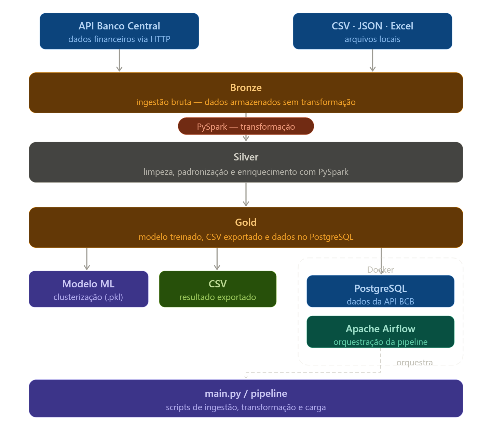

As camadas são organizadas assim:

- Bronze: ingestão bruta dos arquivos e da API, com persistência em Parquet
- Silver: padronização de colunas, limpeza, tipos, datas e qualidade dos dados
- Gold: modelagem dimensional, tabela fato, dimensões e agregações para consumo analítico
- ML: segmentação de clientes a partir da Gold com K-Means e escolha automática de `k` por `silhouette score`

## Decisões técnicas

### Python e PySpark

PySpark foi escolhido porque o desafio pede Pandas ou Spark e o projeto foi estruturado para lidar com processamento em lotes, armazenamento em Parquet e separação clara por camada. As transformações da Bronze e Silver rodam em Spark. A etapa Gold consolida os dados em SQLAlchemy e exporta saídas analíticas em Parquet e CSV.

### PostgreSQL com SQLAlchemy

O banco relacional foi escolhido para persistir o modelo analítico e reforçar a separação entre ingestão, tratamento e consumo. SQLAlchemy foi usado para:

- criar o schema dimensional
- controlar sessões e cargas
- persistir dimensões, fatos e clusters de clientes

### Modelagem

Foi adotado Star Schema com as seguintes estruturas:

- `date_dim`
- `currency_dim`
- `customer_dim`
- `category_dim`
- `account_dim`
- `transaction_fact`
- `exchange_rate_fact`

`account_dim` separa o tipo da conta (`PAGAR` e `RECEBER`) por categoria e `transaction_fact` armazena o valor original, o valor em BRL e a taxa de câmbio utilizada.

### Regra de moeda

Os arquivos de contas não possuem moeda explícita. Para manter coerência com o enunciado e com a base de clientes, a moeda das receitas foi derivada a partir do país do cliente:

- Brasil -> BRL
- Estados Unidos -> USD
- Portugal e França -> EUR
- Reino Unido -> GBP
- Canadá -> CAD
- Argentina -> ARS

Para contas a pagar, a moeda adotada foi BRL.

## Notebooks Analíticos

O projeto inclui dois notebooks Jupyter para análise exploratória dos dados:

### EDA_banco_dados.ipynb

Análise exploratória do banco de dados PostgreSQL gerado pela pipeline. Este notebook conecta-se automaticamente ao banco (testando as portas 5433 e 5432) e realiza análises dimensionais completas.

**Seções principais:**

1. **Volume de Registros por Tabela** - Visualiza a quantidade de registros em cada tabela do modelo dimensional
2. **Estrutura do Banco** - Exibe a estrutura de todas as tabelas com colunas e tipos de dados
3. **Receita por Tipo de Conta** - Compara volume financeiro entre contas RECEBER e PAGAR
4. **Receita por Moeda** - Análise da distribuição financeira entre as diferentes moedas (EUR, GBP, USD, CAD, BRL)
5. **Análise de Clusters** - Quantidade de clientes e receita total por cluster
6. **Distribuição Geográfica** - Heatmap mostrando a relação entre países e clusters
7. **Série Temporal de Receita e Transações** - Evolução mensal com tendências
8. **Top 10 Categorias** - Ranking das categorias com maior receita total
9. **Top 15 Clientes** - Ranking dos clientes com maior geração de receita
10. **Taxa de Câmbio** - Análise das taxas médias de câmbio por moeda

### EDA_customer_summary_final.ipynb

Análise exploratória da base de clientes segmentados. Integra dados do `customer_summary.csv` com os clusters gerados pelo modelo de machine learning, respondendo questões comerciais críticas.

**Análises principais:**

- Distribuição de clientes entre clusters
- Clusters maiores vs. clusters mais lucrativos
- Ticket médio por grupo
- Concentração de receita (Pareto)
- Identificação de clientes VIP (top 20%)
- PCA para visualização 2D dos clusters
- Estabilidade de compra dos clientes
- Composição por país e moeda
- Perfil detalhado de cada cluster

## Gráficos do Banco de Dados

Todos os gráficos do notebook `EDA_banco_dados.ipynb` foram formatados com paleta de cores profissional (azul escuro e verde escuro) para melhor visualização e clareza executiva.

### Receita Total por Tipo de Conta

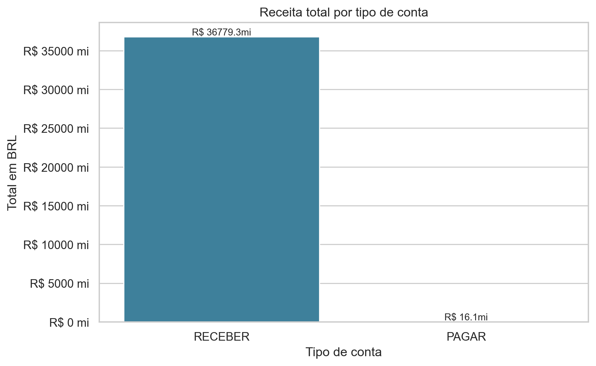

**O que mostra:** Comparação entre o volume financeiro das contas RECEBER e PAGAR no banco.

**Insights principais:**
- Conta RECEBER domina com R$ 36.779 milhões
- Conta PAGAR representa apenas R$ 16,1 milhões
- O banco está fortemente orientado para receita (entrada de dinheiro)
- Proporção de 95% receita vs 5% despesa

### Receita Total por Moeda

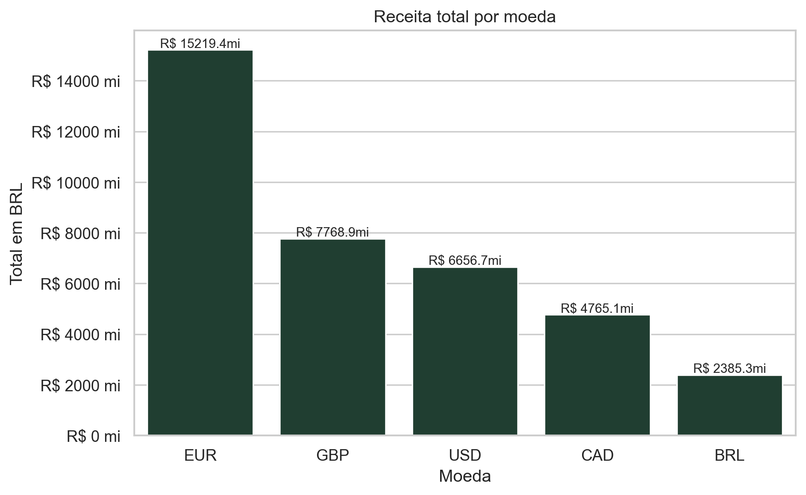

**O que mostra:** Distribuição financeira entre as moedas disponíveis no banco, todas convertidas para BRL.

**Insights principais:**
- EUR (Euro) lidera com R$ 15.219 milhões (33% do total)
- GBP (Libra Esterlina) com R$ 7.769 milhões
- USD (Dólar Americano) com R$ 6.657 milhões
- CAD (Dólar Canadense) com R$ 4.765 milhões
- BRL (Real) com R$ 2.385 milhões
- As moedas estrangeiras concentram 66% da receita, refletindo forte atuação internacional

### Clientes e Receita por Cluster

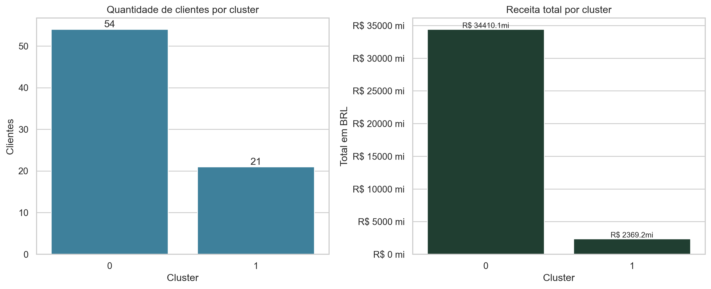

**O que mostra:** Comparação entre tamanho (quantidade de clientes) e lucratividade (receita total) de cada cluster.

**Insights principais:**
- Cluster 0: 54 clientes gerando R$ 34.410 milhões (92% da receita total)
- Cluster 1: 21 clientes gerando R$ 2.369 milhões (8% da receita total)
- Cluster 0 possui menor quantidade de clientes mas concentra quase toda receita
- Taxa de receita por cliente no Cluster 0 é ~3x maior que no Cluster 1

### Distribuição de Países por Cluster

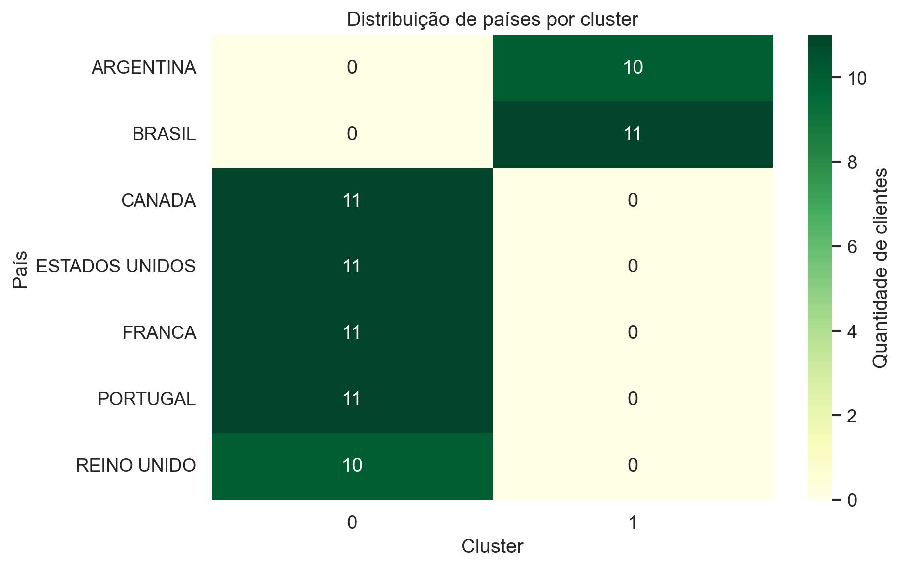

**O que mostra:** Heatmap indicando concentração de clientes por país em cada cluster.

**Insights principais:**
- Cluster 0: Canadá (11), Estados Unidos (11), França (11), Portugal (11), Reino Unido (10) - clientes internacionais
- Cluster 1: Brasil (11), Argentina (10) - clientes da América Latina
- Separação geográfica clara entre clusters
- Cluster 0 concentra clientes de países desenvolvidos e maior poder de compra

## Gráficos de Análise de Clientes

O notebook `EDA_customer_summary_final.ipynb` realiza análise exploratória dos clientes segmentados, integrando dados de receita com os clusters gerados pelo modelo de machine learning.

### Quantidade de Clientes por Cluster

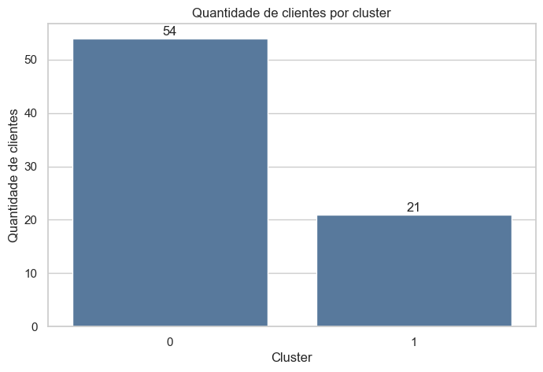

**O que mostra:** Distribuição quantitativa de clientes entre os clusters.

**Insights principais:**
- Cluster 0: 54 clientes (72% do total)
- Cluster 1: 21 clientes (28% do total)
- Cluster 0 concentra a maioria dos clientes
- Proporção aproximada de 2,6:1 a favor do Cluster 0

### Receita Média e Ticket Médio por Cluster

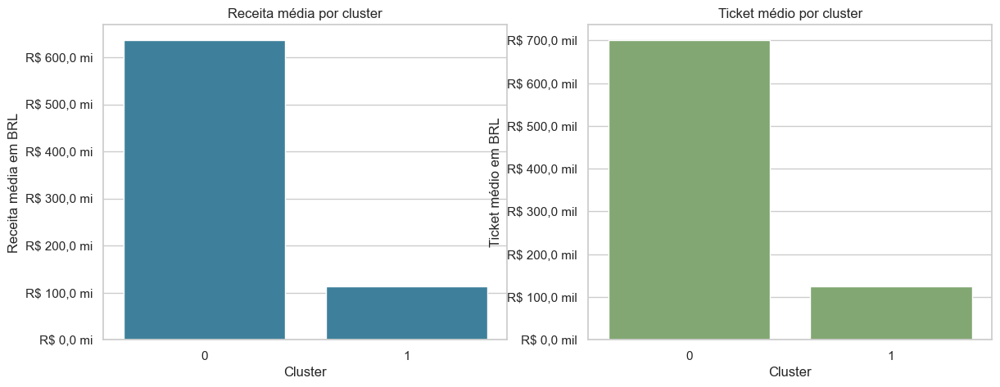

**O que mostra:** Comparação da receita média por cliente e do ticket médio por transação em cada cluster.

**Insights principais:**
- Receita média Cluster 0: R$ 631,5 milhões (6x maior que Cluster 1)
- Receita média Cluster 1: R$ 112,8 milhões
- Ticket médio Cluster 0: R$ 700 milhões (7x maior)
- Ticket médio Cluster 1: R$ 100 milhões
- Cluster 0 contém clientes significativamente mais valiosos por transação

### Participação de Clientes vs Participação de Receita

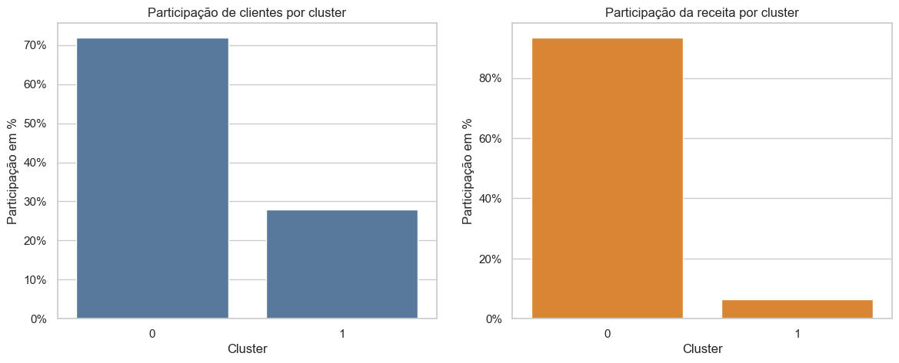

**O que mostra:** Comparação entre percentual de clientes e percentual de receita por cluster, revelando eficiência econômica.

**Insights principais:**
- Cluster 0: 72% dos clientes | 92% da receita (eficiência 1,28x)
- Cluster 1: 28% dos clientes | 8% da receita (eficiência 0,29x)
- Desproporção evidente entre quantidade de clientes e valor gerado
- Cluster 0 é altamente eficiente - poucos clientes geram muita receita

### Análise de Pareto da Receita

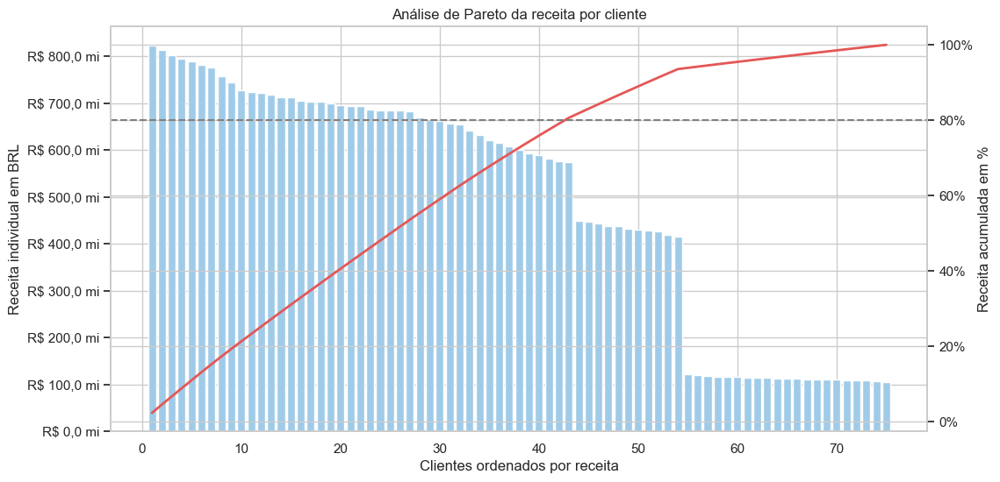

**O que mostra:** Curva de concentração de receita, mostrando quantos clientes são necessários para gerar cada percentual acumulado de receita.

**Insights principais:**
- Os 20% maiores clientes concentram ~80% da receita (regra 80/20 confirmada)
- Curva em "J" típica de distribuição de Pareto
- Primeiros ~15 clientes geram 50% da receita total
- Indica forte concentração em clientes de alto valor
- Estratégia de CRM crítica focada em top clientes

### Receita VIPs vs Demais Clientes

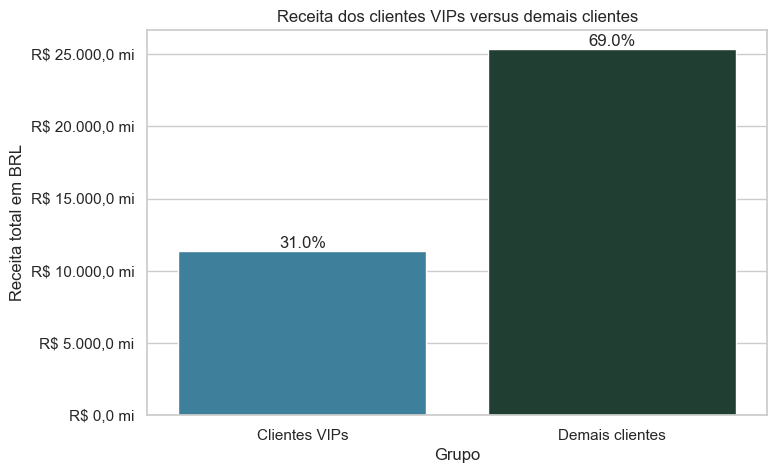

**O que mostra:** Separação entre receita gerada pelos 20% maiores clientes (VIPs) versus os demais clientes.

**Insights principais:**
- Clientes VIPs (20% da base): R$ 11 bi (31% da receita)
- Demais clientes (80%): R$ 25 bi (69% da receita)
- Distribuição mais equilibrada que esperado (não é concentração 80/20 extrema)
- VIPs são importantes mas diferença não é tão pronunciada
- Indicação de base de clientes relativamente saudável

### PCA 2D dos Clusters

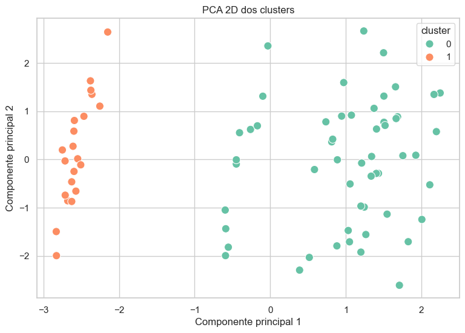


**O que mostra:** Projeção dos clientes em duas dimensões principais, visualizando separação entre clusters.

**Insights principais:**
- Cluster 0 (verde): concentrado no lado direito, mais homogêneo
- Cluster 1 (laranja): concentrado no lado esquerdo, ligeiramente disperso
- Separação visual clara entre clusters
- Primeira componente principal parece representar receita/ticket
- Segunda componente captura variação de estabilidade ou volume de transações
- Segmentação bem definida pelo modelo K-Means

### Distribuição da Estabilidade de Compra

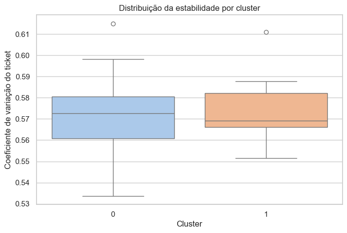

**O que mostra:** Variabilidade do ticket médio dos clientes, medida pelo coeficiente de variação em cada cluster.

**Insights principais:**
- Cluster 0: mediana ~0,575 (coeficiente de variação moderado)
- Cluster 1: mediana ~0,570 (ligeiramente mais estável)
- Ambos clusters mostram estabilidade similar
- Alguns outliers em ambos clusters (clientes com comportamento errático)
- Distribuição de estabilidade é comparável entre os grupos
- Não há diferença significativa em previsibilidade de compra

### Composição dos Clusters por País

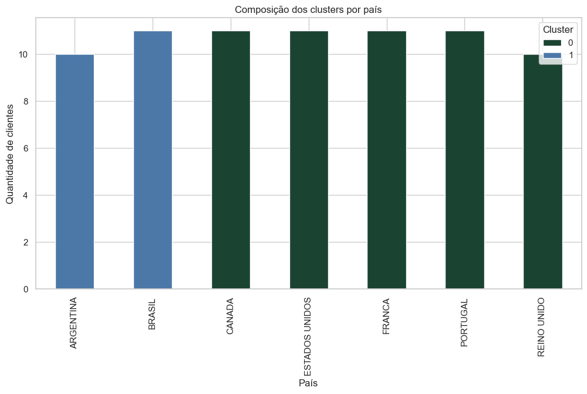

**O que mostra:** Distribuição de clientes por país e cluster, mostrando identidade geográfica de cada segmento.

**Insights principais:**
- Cluster 0 (verde escuro): Canadá, Estados Unidos, França, Portugal, Reino Unido
- Cluster 1 (azul): Argentina (10 clientes), Brasil (11 clientes)
- Separação geográfica é determinante da segmentação
- Cluster 0 = clientes internacionais (países desenvolvidos)
- Cluster 1 = clientes latino-americanos
- Padrão de moeda e país influencia comportamento de compra
- Cluster 0 concentra clientes de países desenvolvidos e maior poder de compra

### Evolução Mensal de Receita e Transações

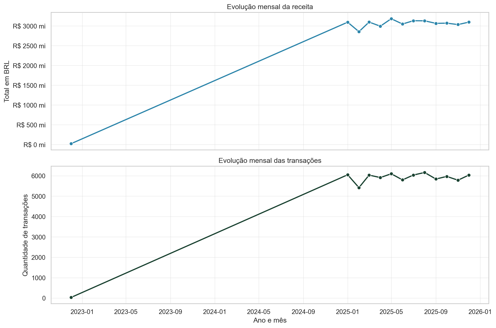

**O que mostra:** Tendência temporal da receita e volume de transações ao longo dos meses.

**Insights principais:**
- Receita: crescimento consistente de jan/2023 a set/2025, atingindo ~R$ 3.000 milhões/mês
- Transações: padrão similar com ~6.000 transações/mês no plateau
- Crescimento de aproximadamente 200% no período observado
- Operação estável no período final analisado

### Top 10 Categorias por Receita

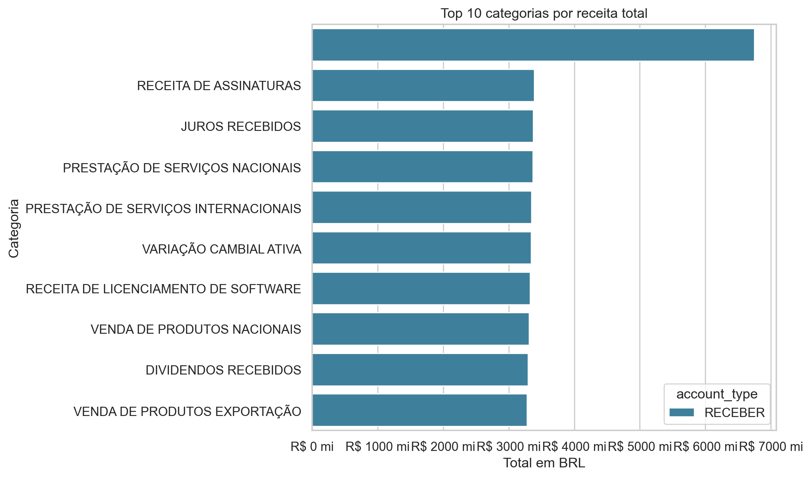

**O que mostra:** Ranking das categorias com maior volume financeiro acumulado.

**Insights principais:**
- Todas as top 10 categorias são do tipo RECEBER
- Categoria de topo gera ~R$ 7.000 milhões
- Segunda colocada com ~R$ 2.500 milhões
- Categorias tendem a ser variadas (juros, assinaturas, prestação de serviços, etc.)
- Concentração em receitas de serviços e juros recebidos


## Estrutura de pastas

```text
desafio_ray/
├── main.py
├── README.md
├── requirements.txt
├── docker-compose.yml
├── .env
├── dags/
│   └── medallion_pipeline_dag.py
├── data/
│   ├── data_raw/
│   ├── bronze/
│   ├── silver/
│   └── gold/
├── logs/
├── notebooks/
│   ├── EDA_banco_dados.ipynb
│   └── EDA_customer_summary_final.ipynb
├── src/
│   ├── bronze/
│   │   └── ingestion.py
│   ├── silver/
│   │   └── transformation.py
│   ├── gold/
│   │   └── aggregation.py
│   ├── ml/
│   │   └── clustering.py
│   ├── utils/
│   │   ├── database.py
│   │   └── logger.py
│   └── config/
│       └── config.py
└── tests/
    ├── test_bronze.py
    ├── test_silver.py
    ├── test_gold.py
    └── test_ml.py
```

## O que cada módulo faz

- `main.py`: orquestra a execução completa do pipeline
- `src/config/config.py`: centraliza paths, banco, API e parâmetros de ML
- `src/utils/logger.py`: cria logs em JSON
- `src/utils/database.py`: define modelos SQLAlchemy e conexão com o banco
- `src/bronze/ingestion.py`: lê arquivos brutos, consulta a PTAX e grava Parquet na Bronze
- `src/silver/transformation.py`: padroniza colunas e tipos e grava Parquet na Silver
- `src/gold/aggregation.py`: popula dimensões e fatos, gera agregações analíticas e exports Gold
- `src/ml/clustering.py`: prepara atributos, escolhe `k`, executa K-Means e salva segmentação
- `dags/medallion_pipeline_dag.py`: orquestra as etapas com Airflow
- `notebooks/EDA_banco_dados.ipynb`: análise exploratória do banco de dados PostgreSQL com visualizações em azul escuro e verde escuro
- `notebooks/EDA_customer_summary_final.ipynb`: análise exploratória dos clientes segmentados com integração de clusters

## O que acontece em cada camada

### Bronze

- leitura dos arquivos CSV, Excel e JSON
- consulta das cotações do Banco Central
- adição de metadados de origem e data de ingestão
- persistência em Parquet

### Silver

- normalização de nomes de colunas
- padronização de datas e tipos numéricos
- remoção de duplicidades
- padronização de status e campos textuais
- score de qualidade por conjunto tratado

### Gold

- criação do schema dimensional no PostgreSQL
- carga das dimensões de cliente, categoria, moeda, conta e data
- carga da tabela fato de transações
- carga das cotações em `exchange_rate_fact`
- geração de datasets analíticos:
  - `transactions_enriched`
  - `customer_summary`
  - `category_summary`
  - `monthly_summary`

## Machine Learning

O problema pedido no desafio é de agrupamento de clientes. Por isso foi utilizado K-Means, com as seguintes métricas:

- `silhouette_score`
- `davies_bouldin_index`
- `calinski_harabasz_index`

O número de clusters pode ser informado por variável de ambiente. Quando `N_CLUSTERS=0`, o projeto testa vários valores e escolhe o melhor `k` pelo maior `silhouette score`.

Saídas do ML:

- `data/gold/ml_results/customer_segments.parquet`
- `data/gold/ml_results/customer_segments.csv`
- `data/gold/ml_results/metricas_clusterizacao.csv`
- `data/gold/ml_results/metricas_por_cluster.csv`
- `data/gold/ml_results/analise_k.csv`
- `data/gold/ml_results/analise_k.png`
- `data/gold/ml_results/clusters_plot.png`

## Como executar

### Opção 1: execução local

1. Instale as dependências:

```bash
pip install -r requirements.txt
```

2. Ajuste o `.env` se necessário.

3. Execute o pipeline:

```bash
python main.py
```

### Opção 2: banco e Airflow com Docker

```bash
docker compose up -d
```

Com o Airflow no ar, a DAG `medallion_pipeline` fica disponível na interface web.

## Testes

Para rodar os testes:

```bash
python -m unittest discover -s tests -p "test_*.py"
```

Os testes de Bronze e Silver dependem de `pyspark`. Se o pacote não estiver instalado, eles são ignorados automaticamente.

## Outputs esperados

### Bronze

- `meta_raw.parquet`
- `categoria_raw.parquet`
- `conta_pagar_raw.parquet`
- `conta_receber_raw.parquet`
- `cliente_raw.parquet`
- `bcb_exchange_rates_raw.parquet`

### Silver

- `meta_transformed.parquet`
- `categoria_transformed.parquet`
- `conta_pagar_transformed.parquet`
- `conta_receber_transformed.parquet`
- `cliente_transformed.parquet`
- `exchange_rates_transformed.parquet`

### Gold

- `transactions_enriched.parquet`
- `customer_summary.parquet`
- `category_summary.parquet`
- `monthly_summary.parquet`
- artefatos de segmentacao em `data/gold/ml_results/`

## Observações finais

- Os logs são gerados em JSON para facilitar auditoria e observabilidade.
- A DAG do Airflow reutiliza o mesmo pipeline da execução local.
- O projeto não usa dados sintéticos para mascarar ausência de arquivos obrigatórios.
